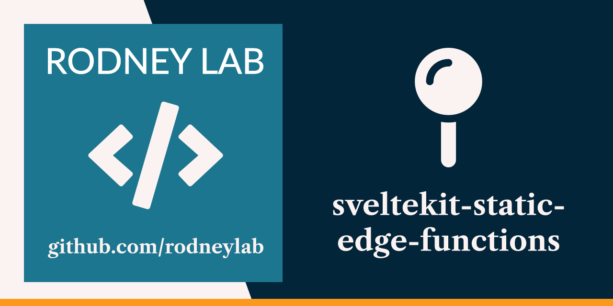

<p align="center">
  <a aria-label="Open Rodney Lab site" href="https://rodneylab.com" rel="nofollow noopener noreferrer">
    
  </a>
</p>
<h1 align="center">
  SvelteKit Edge Functions
</h1>

# sveltekit-static-edge-functions

[](https://stackblitz.com/github/rodneylab/sveltekit-static-edge-functions)

Demo code for exposing your SvelteKit app to Netlify Edge function on your localhost. The code accompanies the <a aria-label="Open Rodney Lab blog post on Svelte Kit Netlify Edge Functions" href="https://rodneylab.com/sveltekit-local-edge-functions/">post on SvelteKit Netlify Edge Functions</a>. If you have any questions, please drop a comment at the bottom of that page.

## Building and previewing the site

If you're seeing this, you've probably already done this step. Congrats!

```bash
git clone https://github.com/rodneylab/sveltekit-static-edge-functions.git
cd sveltekit-static-edge-functions
pnpm install # or npm install
pnpm dev
```

## Building

```bash
pnpm run build
```

> You can preview the built app with `pnpm preview`, regardless of whether you installed an adapter. This should _not_ be used to serve your app in production.

Feel free to jump into the [Rodney Lab matrix chat room](https://matrix.to/#/%23rodney:matrix.org).
